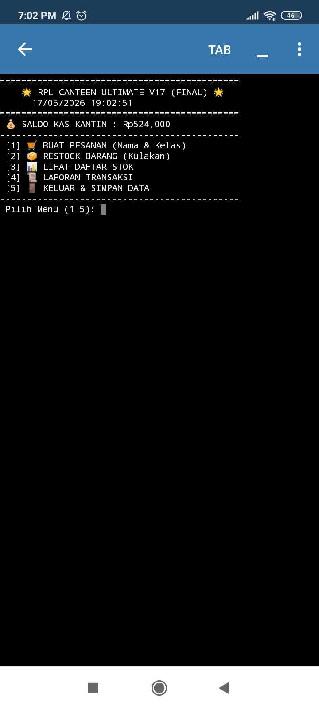
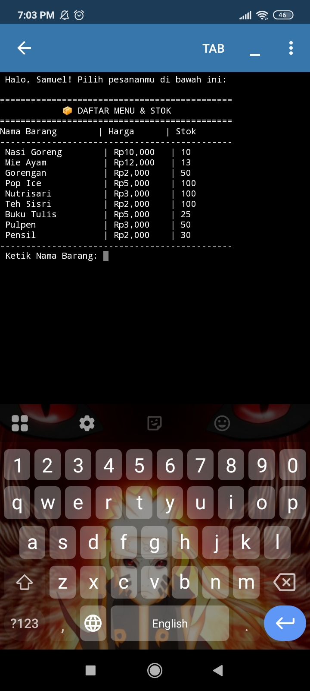
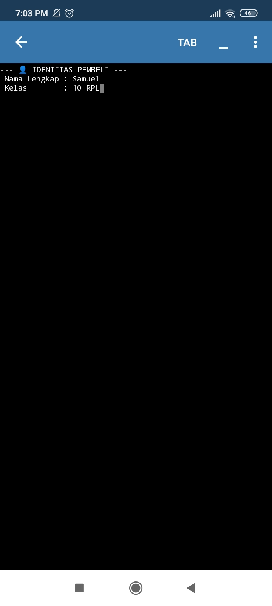
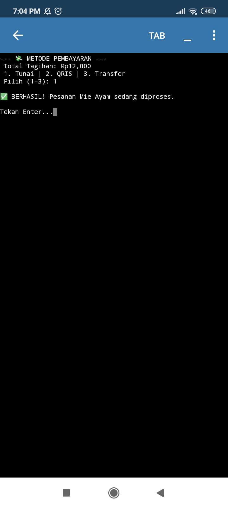

# 🏪 RPL Canteen Wow

Aplikasi kasir kantin berbasis Terminal (TUI) yang dikembangkan untuk mempermudah manajemen stok dan transaksi di kantin sekolah. Versi V17 ini adalah versi paling stabil dengan fitur perlindungan data otomatis.

---

## 📸 Screenshot Aplikasi

  
Klik untuk melihat galeri foto aplikasi 📸

  
  ### 1. Menu Utama & Saldo Kas
  
  
  ### 2. Form Identitas (Nama & Kelas)
  
  
  ### 3. Pilihan Menu
  
  
  ### 4. Metode Pembayaran & Struk
  
  

---

## 🚀 Fitur Unggulan

- **🔐 Secured Entry**: Sistem wajib input Nama & Kelas sebelum transaksi untuk validasi data pembeli.
- **🥤 Smart Drink System**: Deteksi otomatis untuk menu minuman rasa-rasa (Pop Ice, Nutrisari, Teh Sisri).
- **💸 Triple Payment**: Mendukung pembayaran melalui **Tunai**, **QRIS**, dan **Transfer Bank**.
- **📈 Auto-Restock & Budgeting**: Mengurangi saldo kas kantin secara otomatis saat membeli stok baru (kulakan).
- **🛡️ Anti-Crash Database**: Menggunakan sistem sinkronisasi JSON yang mencegah error `KeyError`.
- **📜 Transaction Logging**: Riwayat 15 transaksi terakhir disimpan secara permanen di database.

---

## 🛠️ Cara Penggunaan

1. **Jalankan Aplikasi**: Buka file `rpl_canteen_elite_wow.py` di Pydroid 3 atau PC.
2. **Menu Penjualan**: Pilih [1], masukkan nama dan kelas, lalu pilih barang yang ingin dibeli.
3. **Menu Restock**: Pilih [2] jika ingin menambah stok barang menggunakan uang kas kantin.
4. **Cek Laporan**: Pilih [4] untuk melihat siapa saja yang sudah belanja hari ini.
5. **Simpan**: Selalu pilih menu [5] untuk keluar agar data tersimpan dengan aman ke file JSON.

---

## 🏗️ Struktur Proyek

- `rpl_canteen_elite_wow.py`: File utama aplikasi Python.
- `rpl_canteen_elite_db.json`: File database (dibuat otomatis oleh sistem).
- `README.md`: Dokumentasi proyek ini.

---
**Developed by Samuel (RPL Team) 🚀**
