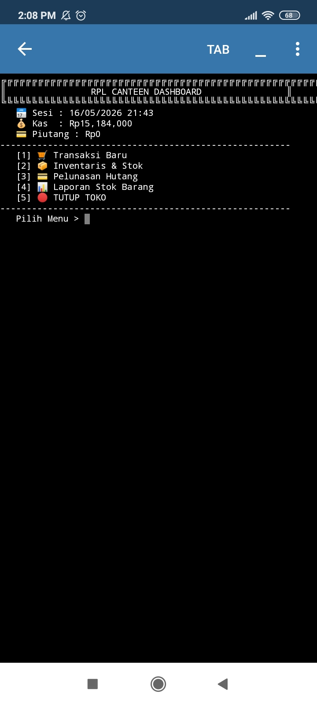

# 🏪 RPL Canteen Elite Edition (V9.0 - FINAL)

Aplikasi manajemen kasir kantin sekolah berbasis **Python** dengan sistem database JSON. Proyek ini dirancang untuk memudahkan pencatatan transaksi dan stok secara digital.

---

## 🚀 Fitur Unggulan
- **💾 Database JSON**: Data tidak hilang saat aplikasi ditutup.
- **📦 Inventaris Pro**: Tambah menu dan stok secara dinamis.
- **💳 Sistem Hutang**: Pencatatan otomatis pelanggan yang belum lunas.
- **📊 Laporan Penjualan**: Rekapitulasi barang paling laris.

---

## 📂 Cara Penggunaan
1. Pastikan file `.py` dan `.json` ada di folder yang sama.
2. Jalankan `rpl_canteen_elite_wow.py` di **Pydroid 3**.
3. Input Nama, Kelas, dan Pesanan sesuai instruksi terminal.

---

## 👨‍💻 Developer
**Samuel** - Siswa RPL
